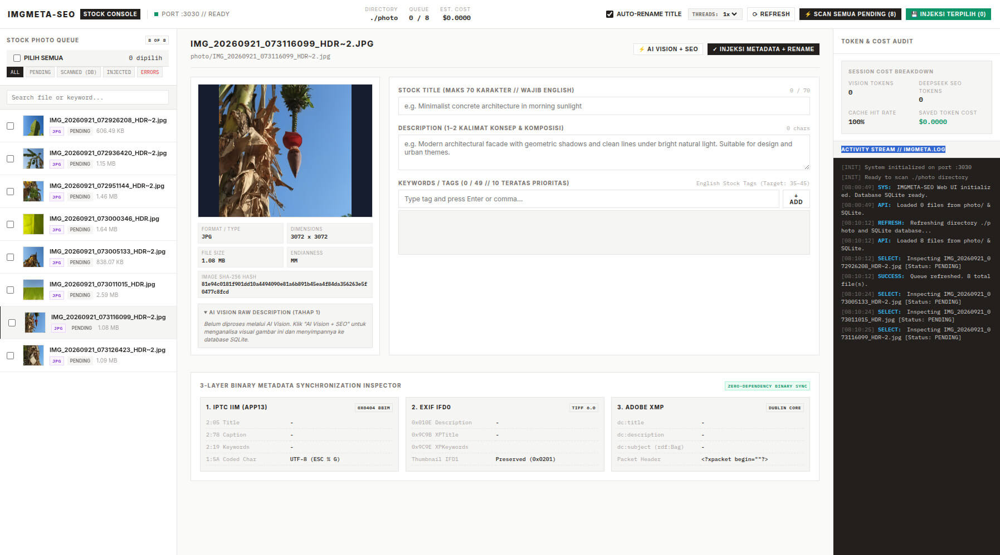

# IMGMETA-SEO — Microstock Metadata Automation Console

[](https://nodejs.org/)
[](https://nodejs.org/api/esm.html)
[](https://nodejs.org/)
[](https://nodejs.org/api/sqlite.html)
[](#-pengujian-internal-selftest)
[](https://www.paypal.com/paypalme/setopratama)

**IMGMETA-SEO** adalah CLI dan Web UI berkinerja tinggi tanpa dependensi eksternal (*zero external runtime dependencies*) untuk otomatisasi metadata foto microstock. Didesain khusus untuk kontributor di **Adobe Stock, Shutterstock, Freepik, dan Getty Images**.

Tool ini menggabungkan parser biner murni dengan arsitektur **AI 2-Tahap Hemat Token** (AI Vision + DeepSeek 4 Flash) untuk menghasilkan Judul, Deskripsi, dan Kata Kunci berperingkat tinggi, lalu menyuntikkannya langsung ke 3 lapisan metadata file (**IPTC IIM + EXIF IFD0 + Adobe XMP Dublin Core**) secara sinkron.



---

## ✨ Fitur Utama

- 🚀 **Zero External Dependencies:** Semua parser dan serializer biner (JPEG, PNG, TIFF/EXIF, IPTC IIM, XMP, SVG, EPS, CRC32) ditulis murni menggunakan modul bawaan Node.js (`node:fs`, `node:buffer`, `node:crypto`, `node:sqlite`). Tidak memerlukan `exiftool`, `sharp`, atau `imagemagick`.
- 🤖 **Pipeline AI 2-Tahap (Hemat Token):**
  1. **Tahap 1 — AI Vision (Downscale In-Memory):** Menganalisa 6 dimensi komersial (fokal utama, komposisi, pencahayaan, palet warna, tekstur mikro, dan target pasar) dengan konsumsi token minimal.
  2. **Tahap 2 — DeepSeek 4 Flash SEO:** Mengubah analisa visual mentah menjadi metadata SEO siap stok (Title front-loaded $\le 70$ karakter, 35–45 keyword bertingkat).
- ⚡ **Web UI Industrial Console:**
  - Antarmuka web modern dengan arsitektur **Worker Pool (Threads Konkurensi 1x–4x)**.
  - **Antrian Checklist Dinamis:** Kemampuan memproses hanya file-file tertentu yang dipilih/dicentang atau seluruh folder.
  - Tombol kontrol pembatalan antrean (`⏹ Batal Antrean`) dan live progress bar realtime.
  - 3-Layer Metadata Inspector & live SQLite Staging sync.
- 🔒 **Sinkronisasi 3-Lapisan Metadata:**
  1. **IPTC IIM:** Record 2 (Title `0x05`, Keywords `0x19`, Description `0x78`, Author `0x50`) dengan deklarasi karakter UTF-8 (`ESC % G`).
  2. **EXIF IFD0:** `ImageDescription` (`0x010E`), `XPTitle` (`0x9C9B`), `XPKeywords` (`0x9C9E`), `XPComment` (`0x9C9C`), `XPAuthor` (`0x9C9D`) dalam encoding UTF-16LE / UCS-2.
  3. **Adobe XMP Dublin Core:** `<dc:title>`, `<dc:description>`, `<dc:subject>` (`rdf:Bag`), `<dc:creator>`.
- 💾 **Database SQLite Lokal (`node:sqlite`):**
  - Menggunakan mode **WAL (Write-Ahead Logging)** untuk eksekusi paralel bebas locking.
  - Caching SHA-256 otomatis (`imageHash + promptVersion`) untuk menghindari biaya token ganda pada file yang sama.
  - Pelacakan estimasi biaya (USD) dan total token AI per batch.
- 📁 **Auto-Rename Ramah SEO:** Mengubah nama file secara otomatis menjadi judul SEO yang bersih dan aman dari tabrakan nama file (*collision safety*).

---

## 🎯 Format Berkas yang Didukung

| Format | Ekstensi | Lapisan Metadata yang Disinkronkan |
| :--- | :--- | :--- |
| **JPEG** | `.jpg`, `.jpeg` | IPTC IIM (APP13 8BIM), EXIF IFD0 (APP1), Adobe XMP Dublin Core (APP1) |
| **PNG** | `.png` | Chunk `eXIf` (TIFF IFD0), Chunk `tEXt` / `iTXt` (UTF-8 XMP & Tags), Manual CRC32 |
| **SVG** | `.svg` | Blok `<metadata>` RDF/XMP Dublin Core, tag `<title>` dan `<desc>` XML |
| **EPS** | `.eps` | Komentar DSC PostScript (`%%Title:`, `%%Keywords:`, `%%Author:`, `%%Subject:`) |

---

## 🏗️ Alur Kerja & Arsitektur

```text
Foto (photo/) 
     │
     ▼
[Tahap 1: AI Vision] ──(Downscale In-Memory & Cache SHA-256)──► Deskripsi Visual 6 Pilar
                                                                         │
     ┌───────────────────────────────────────────────────────────────────┘
     ▼
[Tahap 2: DeepSeek 4 Flash] ──(Algoritma SEO Stock)──► Title (≤70 char), Desc, 35-45 Tags
                                                               │
     ┌─────────────────────────────────────────────────────────┘
     ▼
[Injeksi Biner Zero-Dependency]
     ├── 1. IPTC IIM (APP13 8BIM UTF-8)
     ├── 2. EXIF IFD0 (TIFF Header & UCS-2 XP-Tags)
     └── 3. Adobe XMP Dublin Core (<dc:title>, <dc:subject>, <dc:description>)
```

---

## 📁 Struktur Direktori

```text
autometadata/
├── index.js            # Entry point CLI (run(process.argv.slice(2)))
├── package.json        # Manifest konfigurasi modul ESM
├── .env.example        # Template konfigurasi API Key & Model
├── .gitignore          # Proteksi berkas sensitif, db, photo, dan cache
├── AGENTS.md           # Panduan teknis & invariant sistem
├── DESIGN.md           # Prinsip desain Industrial Minimalist Console
├── docs/
│   └── assets/         # Folder gambar dan diagram dokumentasi
├── photo/              # Folder kerja utama untuk meletakkan file foto (.gitkeep)
├── public/             # Aset Web UI Frontend (HTML, Vanilla CSS, JS)
│   ├── index.html
│   ├── style.css
│   └── app.js
├── src/                # Kode sumber engine backend & binary parsers
│   ├── cli.js          # Subperintah CLI (scan, read, web, selftest)
│   ├── server.js       # HTTP server murni Node.js (REST API & Web UI)
│   ├── db.js           # Engine SQLite WAL bawaan (node:sqlite)
│   ├── vision.js       # Tahap 1: AI Vision analysis
│   ├── seo.js          # Tahap 2: DeepSeek SEO refinement
│   ├── cache.js        # Cache SHA-256 & prompt versioning
│   ├── cost.js         # Pelacak token & estimasi biaya per model
│   ├── meta.js         # High-level binary metadata manager
│   ├── jpeg.js         # Parser/Serializer JPEG APP1, APP13, SOF
│   ├── png.js          # Parser/Serializer PNG chunks & manual CRC32
│   ├── exif.js         # Parser/Serializer TIFF/EXIF IFD0, IFD1, Endianness
│   ├── iptc.js         # Parser/Serializer IPTC IIM Photoshop 8BIM
│   ├── xmp.js          # Parser/Serializer Adobe XMP Dublin Core
│   ├── svg.js          # Parser/Serializer SVG metadata XML
│   ├── eps.js          # Parser/Serializer PostScript EPS DSC
│   └── utils.js        # Logging, warna ANSI, sanitasi nama file
└── test/
    └── selftest.js     # Pengujian internal round-trip biner
```

---

## ⚙️ Persyaratan Sistem & Instalasi

- **Node.js $\ge$ 22.0.0** (Memerlukan dukungan bawaan ESM dan `node:sqlite`).
- Kunci API OpenRouter (atau provider OpenAI/DeepSeek kompatibel).

### 1. Clone Repository
```bash
git clone git@github.com:setopratama/autometadata.git
cd autometadata
```

### 2. Konfigurasi Environment (`.env`)
Salin berkas contoh `.env.example` ke `.env`:
```bash
cp .env.example .env
```
Buka `.env` dan isi kunci API Anda:
```env
# OpenRouter API Key (Mendukung Vision dan SEO)
OPENROUTER_API_KEY=sk-or-v1-xxxxxxxxxxxxxxxxxxxxxxxxxxxxxxxx

# Konfigurasi Model Vision (Tahap 1)
VISION_MODEL=openai/gpt-4o-mini

# Konfigurasi Model SEO (Tahap 2)
SEO_MODEL=deepseek/deepseek-v4-flash-0731
```

---

## 🖥️ Panduan Penggunaan

### 1. Menjalankan Web UI Console
Jalankan server lokal:
```bash
npm run web
# atau: node index.js web 3030
```
Buka peramban di **`http://localhost:3030`**.

#### Fitur Web UI:
1. **Pilih File (Checklist):** Centang file yang ingin diproses secara spesifik, atau klik *Pilih Semua*.
2. **Atur Threads Paralel:** Pilih kecepatan worker (`1x`, `2x`, `3x`, atau `4x` threads).
3. **Scan ke SQLite:** Klik `⚡ Scan Terpilih (N)` untuk menganalisa gambar dan menyimpannya ke staging database.
4. **Edit & Review:** Sesuaikan Title, Description, atau Tag secara interaktif dengan penghitung karakter dan deteksi kata kunci terlarang (*trademark filter*).
5. **Injeksi Biner:** Klik `💾 Injeksi Terpilih` untuk menulis metadata biner ke file asli (dengan opsi auto-rename).

---

### 2. Penggunaan CLI

#### Scan & Preview Hasil AI (Dry-Run / Tanpa Menulis File)
```bash
npm start
# atau: node index.js scan "photo/*.*"
```

#### Scan + Injeksi Langsung ke Biner File
```bash
node index.js scan "photo/*.*" --apply
```

#### Scan + Injeksi + Otomatis Rename File Sesuai Title
```bash
node index.js scan "photo/*.*" --apply --rename
```

#### Membaca Metadata yang Ada di File
```bash
node index.js read "photo/*.*"
```

#### Bantuan & Opsi Perintah
```bash
node index.js --help
```

---

## 🧪 Pengujian Internal (Selftest)

Verifikasi integritas parser biner dan validasi algoritma SEO dengan menjalankan internal self-test:

```bash
npm run selftest
```

Output pengujian:
```text
=== IMGMETA-SEO Internal Round-Trip Self-Test ===

  ✓ PASS: EXIF IFD0 TIFF Serialization & Endianness Round-Trip
  ✓ PASS: IPTC IIM & Photoshop 3.0 8BIM (UTF-8) Round-Trip
  ✓ PASS: Adobe XMP Dublin Core (dc:title, dc:subject, dc:description) Round-Trip
  ✓ PASS: JPEG 3-Layer Synchronized Metadata Injection Round-Trip
  ✓ PASS: PNG Chunk Injection & Manual CRC32 Round-Trip
  ✓ PASS: SVG & EPS Metadata Injection Round-Trip
  ✓ PASS: SEO Output Validation & Trademark Filter
  ✓ PASS: SEO Filename Sanitization & Collision Safety

Hasil: 8 dari 8 pengujian lulus.
Semua pengujian lulus.
```

---

## 🏷️ Standar Algoritma SEO Stock

1. **Title (Maksimal 70 Karakter):**
   - Menggunakan formula *front-loaded*: `[Kata Benda Utama] + [Modifier Komersial] + [Konteks Komposisi]`.
   - Tanpa kata pengisi (*A, An, The, Photo of, Image of*).
2. **Description:**
   - 1–2 kalimat yang menjelaskan komposisi, suasana, dan ketersediaan *copy space* untuk desainer.
3. **Kata Kunci / Tags (35–45 Tags Terstruktur):**
   - **Tier 1 (1–10):** Kata kunci utama dari judul dengan bobot pencarian tertinggi.
   - **Tier 2 (11–20):** Spesifikasi visual (sudut kamera, pencahayaan, palet warna, tekstur).
   - **Tier 3 (21–30):** Konsep komersial & emosional.
   - **Tier 4 (31–40+):** Industri, niche bisnis, dan kegunaan akhir.
4. **Sanitasi & Filter Trademark:**
   - Maksimal 2 kata per tag.
   - Otomatis membuang merek dagang (*Apple, Canon, Nike, Porsche, Starbucks*, dll.) dan istilah kamera (*ISO, 50mm, f/2.8*).

---

## 📄 Lisensi

Distributed under the ISC License. Dibuat untuk efisiensi maksimal alur kerja kontributor microstock profesional.
